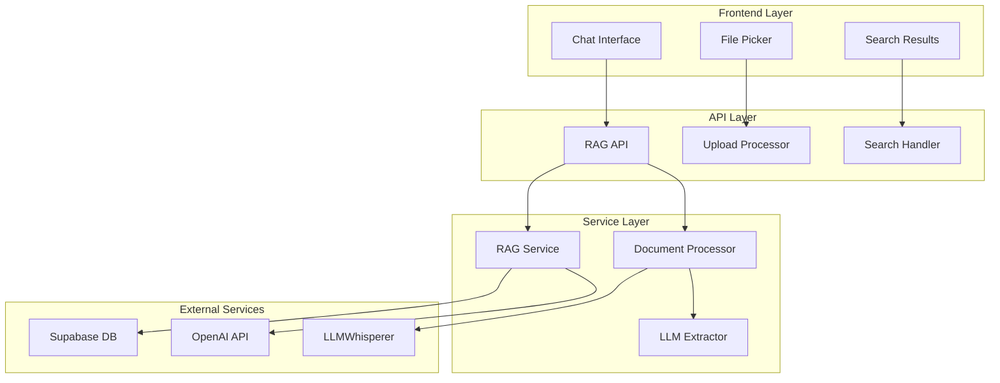
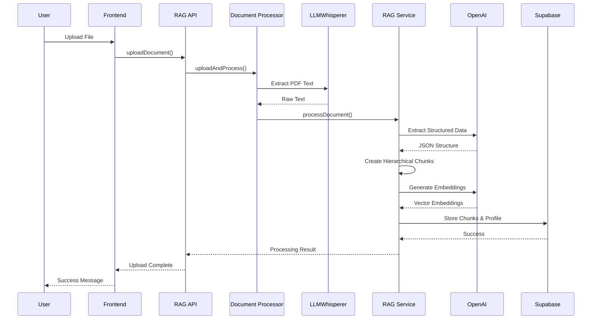
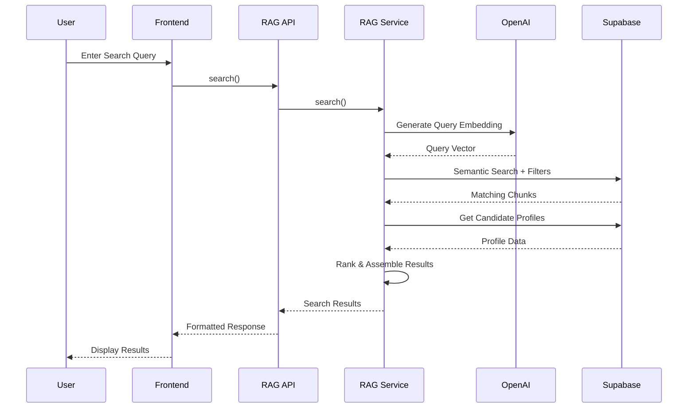

# 🎯 Multi-Dimensional RAG Pipeline Implementation Plan

## Overview

This document outlines the implementation of a sophisticated **Multi-Dimensional RAG (Retrieval-Augmented Generation)** system for the AI Analyst Chat interface. The system goes far beyond traditional RAG approaches by implementing hierarchical chunking, metadata-aware retrieval, and intelligent candidate profile extraction.

## 🏗️ Architecture Overview

### Core Components



## 🎯 Multi-Dimensional RAG Features

### 1. Hierarchical Chunking Strategy

**Traditional RAG**: Fixed-size sliding window chunks
```
Document → [Chunk1][Chunk2][Chunk3]...
```

**Our Multi-Dimensional RAG**: Semantic boundary-aware hierarchical chunks
```
Document → Summary (L1)
        ├── Experience Section (L2)
        │   ├── Achievement Detail (L3)
        │   └── Achievement Detail (L3)
        ├── Education Section (L2)
        └── Skills Section (L2)
```

### 2. Metadata-Enhanced Retrieval

Each chunk carries rich metadata:
- **Company Information**: Name, role, technologies used
- **Temporal Data**: Date ranges, experience duration
- **Skills Mapping**: Technical and soft skills extraction
- **Educational Context**: Institutions, degrees, achievements
- **Hierarchical Context**: Parent-child relationships

### 3. Multi-Vector Embedding Strategy

- **Context-Enhanced Embeddings**: Include candidate name, section type, metadata
- **Semantic Similarity**: Vector-based similarity search
- **Metadata Filtering**: Company, technology, experience level filters
- **Full-Text Search**: PostgreSQL tsvector for keyword matching

### 4. Intelligent Profile Reconstruction

Instead of returning fragmented chunks, the system reconstructs complete candidate profiles:
```typescript
interface CandidateProfile {
  personalInfo: PersonalInfo;
  professionalSummary: string;
  workExperience: WorkExperience[];
  education: Education[];
  skills: Skills;
  completenessScore: number;
}
```

## 📁 File Structure

```
ai-analyst-chat/
├── database/
│   └── schema.sql                 # Complete database schema
├── src/
│   ├── api/
│   │   └── ragApi.ts             # API layer with all endpoints
│   ├── services/
│   │   ├── ragService.ts         # Core RAG orchestration
│   │   └── documentProcessor.ts  # File processing & extraction
│   └── components/
│       └── [existing UI components]
├── .env.example                  # Environment variables template
└── RAG_IMPLEMENTATION_PLAN.md   # This document
```

## 🚀 Setup Instructions

### 1. Environment Configuration

Copy `.env.example` to `.env` and configure:

```bash
# Database Configuration (Supabase)
VITE_SUPABASE_URL=https://your-project-id.supabase.co
VITE_SUPABASE_ANON_KEY=your_supabase_anon_key_here
SUPABASE_SERVICE_ROLE_KEY=your_supabase_service_role_key_here

# AI/ML Configuration
OPENAI_API_KEY=sk-your_openai_api_key_here_starts_with_sk
OPENAI_EMBEDDING_MODEL=text-embedding-3-small
OPENAI_CHAT_MODEL=gpt-4o-mini

# Document Processing
LLMWHISPERER_API_KEY=your_llmwhisperer_api_key_here
LLMWHISPERER_BASE_URL=https://llmwhisperer-api.unstract.com/v1
```

### 2. Database Setup

1. Create a new Supabase project
2. Enable the `vector` extension in SQL Editor:
   ```sql
   CREATE EXTENSION IF NOT EXISTS vector;
   ```
3. Run the complete schema from `database/schema.sql`

### 3. API Keys Setup

**Supabase**:
- Go to Project Settings → API
- Copy Project URL and anon key
- Copy service role key (for server-side operations)

**OpenAI**:
- Visit platform.openai.com
- Create API key in API Keys section

**LLMWhisperer**:
- Sign up at unstract.com
- Get API key from dashboard

### 4. Install Dependencies

```bash
npm install
```

All required dependencies are already installed:
- `@supabase/supabase-js` - Database client
- `openai` - AI/ML operations
- `pdf-parse`, `mammoth`, `xlsx`, `papaparse` - Document processing
- `uuid` - ID generation

## 🔄 Processing Pipeline

### Document Upload Flow



### Search Flow



## 🎯 Key Innovations

### 1. Semantic Boundary Detection

Instead of arbitrary chunk sizes, we detect semantic boundaries:
- **Experience Sections**: Each job/role becomes a chunk
- **Education Blocks**: Each degree/institution becomes a chunk
- **Achievement Granularity**: Individual achievements for detailed search

### 2. Context-Aware Embeddings

Each chunk embedding includes:
```typescript
const embeddingText = [
  chunk.content,
  `Company: ${chunk.companyName}`,
  `Role: ${chunk.jobTitle}`,
  `Technologies: ${chunk.technologies.join(', ')}`,
  `Section: ${chunk.sectionType}`
].join(' | ');
```

### 3. Multi-Factor Ranking

Search results are ranked by:
- **Semantic Similarity**: Vector cosine similarity
- **Metadata Relevance**: Company, technology, role matches
- **Completeness Score**: Profile data completeness
- **Recency**: Date-based relevance

### 4. Hierarchical Context Preservation

Parent-child relationships maintain context:
```sql
-- Get complete hierarchy for a document
SELECT * FROM get_document_hierarchy('doc-uuid');
```

## 📊 Database Schema Highlights

### Core Tables

1. **documents**: File metadata and processing status
2. **document_chunks**: Hierarchical chunks with embeddings
3. **candidate_profiles**: Extracted structured profiles
4. **work_experiences**: Detailed work history
5. **education**: Educational background
6. **search_queries**: Analytics and improvement data

### Advanced Features

- **Vector Similarity Search**: `ivfflat` index for fast similarity queries
- **Full-Text Search**: `gin` index for keyword matching
- **Hierarchical Queries**: Recursive CTEs for parent-child traversal
- **Metadata Filtering**: Composite indexes for filtered searches

## 🔧 API Endpoints

### Document Management
- `POST /upload` - Upload and process document
- `GET /documents` - List processed documents
- `DELETE /documents/:id` - Delete document
- `GET /stats` - System statistics

### Search & Retrieval
- `POST /search` - Basic semantic search
- `POST /search/advanced` - Advanced search with filters
- `GET /suggestions` - Search suggestions
- `GET /profiles/:id` - Get candidate profile

### Processing
- `GET /jobs/:id` - Get processing job status
- `POST /bulk-upload` - Bulk document processing

## 🎯 Next Steps

### Phase 1: Core Implementation ✅
- [x] Database schema design
- [x] RAG service architecture
- [x] Document processing pipeline
- [x] API layer implementation

### Phase 2: Frontend Integration
- [ ] File upload component with progress tracking
- [ ] Search interface with filters
- [ ] Results display with candidate profiles
- [ ] Processing status dashboard

### Phase 3: Advanced Features
- [ ] Real-time search suggestions
- [ ] Advanced filtering UI
- [ ] Bulk upload interface
- [ ] Analytics dashboard

### Phase 4: Production Optimization
- [ ] Caching layer implementation
- [ ] Performance monitoring
- [ ] Error handling & retry logic
- [ ] Rate limiting & security

## 🔍 Testing Strategy

### Unit Tests
- Document processing functions
- Embedding generation
- Search ranking algorithms
- Database operations

### Integration Tests
- End-to-end upload flow
- Search accuracy validation
- API endpoint testing
- Database consistency checks

### Performance Tests
- Large document processing
- Concurrent upload handling
- Search response times
- Memory usage optimization

## 📈 Success Metrics

### Technical Metrics
- **Processing Speed**: < 30 seconds per resume
- **Search Latency**: < 500ms for semantic search
- **Accuracy**: > 90% relevant results in top 5
- **Throughput**: 100+ concurrent uploads

### Business Metrics
- **Profile Completeness**: > 85% average score
- **Search Satisfaction**: User feedback on result relevance
- **Processing Success Rate**: > 95% successful extractions
- **System Uptime**: > 99.9% availability

## 🛡️ Security Considerations

### Data Protection
- Encrypted file storage
- PII data handling compliance
- Access control and authentication
- Audit logging for sensitive operations

### API Security
- Rate limiting per user/IP
- Input validation and sanitization
- SQL injection prevention
- CORS configuration

## 🎯 Conclusion

This Multi-Dimensional RAG implementation represents a significant advancement over traditional RAG systems. By combining hierarchical chunking, metadata-aware retrieval, and intelligent profile reconstruction, we create a system that doesn't just find text matches—it understands candidate profiles and delivers contextually relevant results.

The architecture is designed for scalability, maintainability, and extensibility, making it suitable for enterprise-grade deployment while remaining flexible enough for rapid iteration and improvement.

**Ready for implementation!** 🚀 