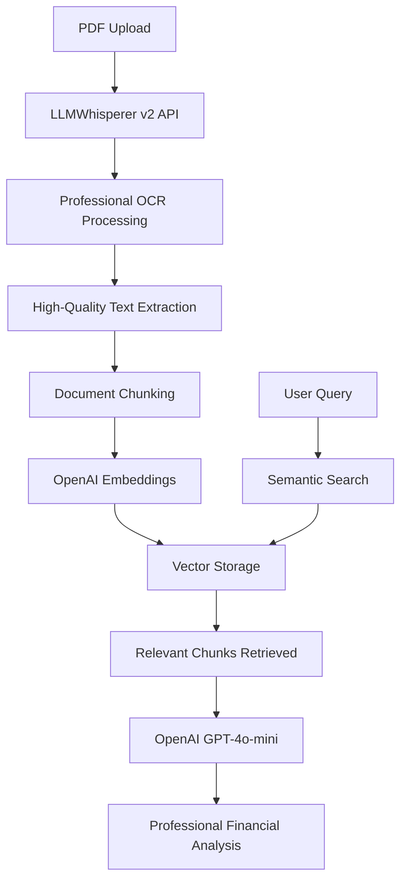

# AI Analyst Chat Interface POC

A professional ChatGPT-style chat interface designed for investment banking and financial analysis. Built with React, TypeScript, and Tailwind CSS with advanced document processing and AI-powered analysis capabilities.


## 🎯 Features

### ✅ **Core Functionality**
- **Professional Chat Interface** - Pixel-perfect ChatGPT-style design
- **AI-Powered Financial Analysis** - OpenAI GPT-4o-mini with specialized financial prompts
- **Professional Document Processing** - LLMWhisperer v2 API for high-quality PDF OCR
- **RAG Pipeline** - Retrieval-Augmented Generation for document-based responses
- **Real-time Messaging** - Instant message exchange with intelligent AI responses
- **Dark Theme** - Professional dark theme optimized for financial professionals
- **Responsive Design** - Works seamlessly on desktop and mobile devices

### ✅ **Advanced Document Processing**
- **LLMWhisperer Integration** - Professional OCR for financial documents
  - **High-Quality Text Extraction** - Superior to basic PDF parsing
  - **Layout Preservation** - Maintains document structure for better analysis
  - **Asynchronous Processing** - Handles large documents efficiently
  - **Error Handling** - Graceful fallback to basic extraction if needed

- **Intelligent Document Analysis**:
  - **Semantic Search** - OpenAI embeddings for relevant content retrieval
  - **Financial Context** - Specialized prompts for investment banking analysis
  - **Multi-Document Support** - Process and analyze multiple financial reports
  - **Chunk-based Storage** - Efficient storage and retrieval of document sections

### ✅ **AI-Powered Analysis**
- **OpenAI Integration** - GPT-4o-mini for conversational responses
- **Financial Expertise** - Specialized system prompts for investment banking
- **Structured Response Format** - Organized as Key Highlights → Financial Performance → Investment Implications
- **Context-Aware Responses** - Uses document content to provide specific insights
- **Professional Terminology** - Appropriate financial language and metrics
- **Data Citation** - References specific numbers and figures from documents
- **Concise Analysis** - Focused on actionable insights without repetitive information

### ✅ **User Interface**
- **Optimized Layout** - Enhanced screen utilization with 85% message width and 6xl container
- **Login System** - Simple authentication with demo user capability
- **Sidebar Navigation** - Collapsible chat history with sample conversations
- **Message History** - Persistent chat sessions with timestamps
- **Auto-expanding Input** - Text area that grows with content and resets after sending
- **File Upload** - Drag-and-drop PDF upload with processing status
- **Responsive Design** - Optimized for modern wide-screen displays

### ✅ **Enterprise Integrations** (ChatGPT-Style Interface)
- **Connect Apps Menu** - Professional integration interface with:
  - **Google Drive** - Access your Google Drive files
  - **Microsoft OneDrive** - Connect to OneDrive for Business
  - **SharePoint** - Access SharePoint documents
  - **Dropbox** - Connect to your Dropbox files
  - **Box** - Access Box cloud storage
  - **Salesforce** - Connect to Salesforce data
  - **Network Drives** - Access local network drives

- **File Actions**:
  - **Add from Microsoft OneDrive (personal)** - Personal OneDrive integration
  - **Add photos and files** - Direct file upload capability

- **Navigation Features**:
  - Expandable "Connect apps" submenu with chevron navigation
  - Clean back button navigation between menus
  - Hover effects and smooth transitions
  - Proper sectioning and visual hierarchy

### ✅ **Sample Data**
- **Pre-loaded Chat History** - Sample financial analysis conversations:
  - Q3 Financial Report Analysis
  - Portfolio Risk Assessment
  - Market Trends Summary

## 🚀 Getting Started

### Prerequisites
- Node.js 18+ 
- npm or yarn
- OpenAI API Key (required)
- LLMWhisperer API Key (optional, for enhanced PDF processing)
- Supabase Account (optional, for production document storage)

### Environment Setup

1. **Clone the repository**
   ```bash
   git clone https://github.com/cklose2000/knowledge_base_chatbot1.git
   cd knowledge_base_chatbot1/ai-analyst-chat
   ```

2. **Install dependencies**
   ```bash
   npm install
   ```

3. **Configure environment variables**
   ```bash
   cp .env.example .env
   ```
   
   Update `.env` with your API keys:
   ```env
   # OpenAI Configuration (Required)
   VITE_OPENAI_API_KEY=sk-your_openai_key_here
   VITE_OPENAI_EMBEDDING_MODEL=text-embedding-3-small
   VITE_OPENAI_CHAT_MODEL=gpt-4o-mini

   # LLMWhisperer v2 API (Optional - for enhanced PDF processing)
   VITE_LLMWHISPERER_API_KEY=your_llmwhisperer_key_here
   VITE_LLMWHISPERER_BASE_URL=https://llmwhisperer-api.us-central.unstract.com/api/v2
   LLMWHISPERER_API_KEY=your_llmwhisperer_key_here

   # Supabase (Optional - for production document storage)
   VITE_SUPABASE_URL=your_supabase_url_here
   VITE_SUPABASE_ANON_KEY=your_supabase_anon_key_here

   # Vector Configuration
   VITE_VECTOR_DIMENSIONS=1536
   VITE_SIMILARITY_THRESHOLD=0.7
   ```

4. **Start the LLMWhisperer proxy server** (if using enhanced PDF processing)
   ```bash
   node server/llmwhisperer-proxy.cjs
   ```

5. **Start the development server**
   ```bash
   npm run dev
   ```

6. **Open your browser**
   Navigate to `http://localhost:5173`

## 🎮 Usage

### Login
1. Click "Login as Demo User" on the welcome screen
2. Enter any username (demo authentication)

### Document Analysis
1. **Upload Financial Documents** - Drag and drop PDF files (earnings reports, 10-K/10-Q filings, etc.)
2. **Ask Questions** - Query the uploaded documents with natural language
   - "Summarize the Q3 earnings results"
   - "What were the key financial metrics?"
   - "How did revenue growth compare to last quarter?"
3. **Get AI Analysis** - Receive professional financial analysis with specific data citations

### Chat Interface
1. **Send Messages** - Type in the input area and press Enter or click Send
2. **View History** - Click the hamburger menu (☰) to see chat history
3. **New Chat** - Click "New Chat" in the sidebar or the + button
4. **File Integration** - Click the + button in the input area to access:
   - **Connect apps** submenu with all enterprise integrations
   - **Direct file upload** options
   - **Personal cloud storage** connections

### Integration Navigation
- **Main Menu** - Click + to see primary options and "Connect apps"
- **Connect Apps** - Click the chevron (>) to see all enterprise integrations
- **Back Navigation** - Use the back arrow (←) to return to main menu
- **Quick Actions** - Access OneDrive personal and file upload directly

## 🏗️ Technical Architecture

### Tech Stack
- **Frontend Framework** - React 18 with TypeScript
- **AI/ML** - OpenAI GPT-4o-mini + text-embedding-3-small
- **Document Processing** - LLMWhisperer v2 API for professional OCR
- **Styling** - Tailwind CSS 3.x (stable version)
- **State Management** - Zustand with persistence
- **Icons** - Lucide React
- **Build Tool** - Vite
- **Routing** - React Router DOM

### Document Processing Pipeline



### Project Structure
```
ai-analyst-chat/
├── src/
│   ├── components/
│   │   ├── chat/
│   │   │   ├── ChatInput.tsx      # Main input with integrations
│   │   │   ├── Message.tsx        # Individual message component
│   │   │   └── MessageList.tsx    # Message container
│   │   ├── layout/
│   │   │   ├── Header.tsx         # Top navigation
│   │   │   └── Sidebar.tsx        # Chat history sidebar
│   │   ├── file-picker/
│   │   │   └── FilePickerModal.tsx # File selection modal
│   │   └── ui/
│   │       ├── Button.tsx         # Reusable button component
│   │       ├── Input.tsx          # Form input component
│   │       └── Modal.tsx          # Modal component
│   ├── services/
│   │   ├── financeRagService.ts   # RAG pipeline for financial documents
│   │   ├── llmWhispererService.ts # LLMWhisperer v2 API integration
│   │   ├── pdfService.ts          # PDF processing fallback
│   │   └── documentProcessor.ts   # Document processing orchestration
│   ├── pages/
│   │   ├── Login.tsx              # Authentication page
│   │   └── Chat.tsx               # Main chat interface
│   ├── store/
│   │   ├── authStore.ts           # Authentication state
│   │   ├── chatStore.ts           # Chat messages with AI integration
│   │   └── fileStore.ts           # File handling state
│   ├── types/
│   │   └── index.ts               # TypeScript type definitions
│   └── App.tsx                    # Main application component
├── server/
│   └── llmwhisperer-proxy.cjs     # Proxy server for LLMWhisperer API
├── memory-bank/                   # Project documentation
├── public/
├── package.json
└── README.md
```

### Key Components

#### AI-Powered Chat Store
- **OpenAI Integration** - GPT-4o-mini for conversational responses
- **RAG Pipeline** - Retrieval-Augmented Generation for document analysis
- **Financial Expertise** - Specialized prompts for investment banking
- **Context Management** - Uses document chunks for informed responses

#### LLMWhisperer Service
- **Professional OCR** - High-quality text extraction from financial PDFs
- **Asynchronous Processing** - Handles large documents efficiently
- **v2 API Integration** - Latest LLMWhisperer API with improved accuracy
- **Error Handling** - Graceful fallback to basic PDF extraction

#### Document Processing Pipeline
- **Multi-format Support** - PDF, text, and other document types
- **Intelligent Chunking** - Semantic document segmentation
- **Vector Embeddings** - OpenAI embeddings for semantic search
- **Financial Context** - Specialized processing for financial documents

#### ChatInput (Enhanced)
- **ChatGPT-style Integrations** - Professional submenu interface
- **Auto-expanding textarea** - Smooth resize with proper reset
- **State Management** - Clean navigation between main menu and submenus
- **Enterprise Integrations** - All major business platforms supported

#### Integration Interface
- **Main Menu** - Clean, focused primary options
- **Connect Apps Submenu** - Full enterprise integration list
- **Navigation** - Intuitive back/forward with proper state management
- **Visual Design** - Consistent with ChatGPT's interface patterns

#### Sidebar
- Fixed positioning (doesn't scroll with chat)
- Sample chat history with timestamps
- Smooth open/close animations

#### Message System
- User and AI message differentiation
- Timestamp display
- File attachment support

## 🎨 Design Features

### Visual Design
- **ChatGPT-Inspired Interface** - Pixel-perfect recreation of ChatGPT's integration UI
- **Professional Dark Theme** - Optimized for financial professionals
- **Enterprise-Ready** - Clean, professional appearance suitable for client demos
- **Smooth Animations** - Polished transitions and micro-interactions

### User Experience
- **Intuitive Navigation** - Familiar ChatGPT-style interaction patterns
- **Responsive Layout** - Works on all screen sizes
- **Keyboard Shortcuts** - Enter to send, Shift+Enter for new line
- **Auto-scroll** - Messages automatically scroll to bottom
- **Loading States** - Visual feedback during AI responses and document processing

## 🔧 Development Notes

### Recent Major Updates (Latest)
- ✅ **Enhanced User Experience** - Improved response quality and screen utilization
  - Redesigned system prompt for concise, structured financial analysis
  - Increased message width from 70% to 85% for better screen usage
  - Expanded container width for optimal readability on modern displays
  - Structured response format: Key Highlights → Financial Performance → Investment Implications
- ✅ **Supabase Production Integration** - Enterprise-ready document storage
  - Complete database schema with vector similarity search
  - HNSW indexing for fast approximate search
  - Financial profiles and analytics storage
  - Row Level Security (RLS) policies for demo and production
  - Hybrid storage system (Supabase + in-memory fallback)
- ✅ **LLMWhisperer v2 Integration** - Professional OCR for financial documents
  - Fixed API parameter issues (`pages_to_extract` handling)
  - Implemented asynchronous processing workflow
  - Added status polling and result retrieval
  - Created proxy server to handle CORS issues
- ✅ **OpenAI RAG Pipeline** - Intelligent document analysis
  - GPT-4o-mini integration for conversational responses
  - Specialized financial analyst system prompts
  - Context-aware responses using document chunks
  - Professional financial terminology and data citation
- ✅ **Enhanced Document Processing** - Complete pipeline from PDF to AI analysis
  - High-quality text extraction with layout preservation
  - Semantic chunking and vector embeddings
  - Multi-document support and efficient storage
  - Graceful error handling and fallback mechanisms

### Previous Updates
- ✅ **System Prompt Optimization** - Enhanced AI responses for investment banking
  - Concise, actionable insights with structured formatting
  - Professional financial terminology and clear section organization
  - Focus on key metrics, trends, and investment implications
- ✅ **ChatGPT-Style Integrations** - Complete recreation of ChatGPT's file integration interface
- ✅ **Enterprise Connectors** - Added all 7 major business platform integrations
- ✅ **Navigation System** - Implemented submenu navigation with proper state management
- ✅ **UI Polish** - Professional styling matching ChatGPT's design patterns
- ✅ **Tailwind CSS Compatibility** - Stable v3.4.15 with proper PostCSS configuration

### Previous Fixes
- ✅ **Text Visibility** - Added fallback CSS for dark theme text rendering
- ✅ **Component Stability** - Fixed timestamp handling and message rendering
- ✅ **Sidebar Positioning** - Resolved overlay issues with fixed positioning
- ✅ **Input Auto-resize** - Textarea properly resets after message submission

### Current Status
- **Production-Ready POC** - Suitable for investment banking client demonstrations
- **Optimized User Experience** - Enhanced screen utilization and response quality
- **AI-Powered Analysis** - Professional financial document analysis with structured insights
- **Enterprise Integrations** - All major business platforms represented
- **Professional UI** - Matches industry-standard chat interfaces with advanced AI features

## 🔑 API Keys Required

### OpenAI (Required)
- **Purpose**: AI-powered chat responses and document analysis
- **Models**: GPT-4o-mini (chat), text-embedding-3-small (embeddings)
- **Get Key**: [OpenAI Platform](https://platform.openai.com/api-keys)

### LLMWhisperer (Optional but Recommended)
- **Purpose**: Professional OCR for financial documents
- **Benefit**: Superior text extraction quality vs basic PDF parsing
- **Get Key**: [Unstract LLMWhisperer](https://unstract.com/llmwhisperer/)

### Supabase (Optional but Recommended for Production)
- **Purpose**: Production document storage and vector database with persistent storage
- **Benefits**: 
  - Persistent storage across sessions
  - Advanced vector similarity search with HNSW indexing
  - Financial profiles and analytics
  - Processing logs and search analytics
  - Automatic fallback to in-memory storage if not configured
- **Setup**: See `SUPABASE_SETUP.md` for detailed step-by-step instructions
- **Get Key**: [Supabase](https://supabase.com/) (free tier available)
- **Status**: ✅ **Production Ready** - Complete integration with RLS policies and error handling

## 📊 Performance

### Document Processing
- **LLMWhisperer**: ~30-60 seconds for 25-page financial reports
- **Semantic Search**: <500ms for document queries
- **AI Response**: 2-5 seconds for comprehensive financial analysis

### Supported Documents
- **PDF Files**: Earnings reports, 10-K/10-Q filings, financial statements
- **Text Quality**: Professional OCR handles scanned documents and complex layouts
- **Size Limits**: Up to 50MB per document
- **Storage Options**: 
  - **Demo Mode**: In-memory storage (no setup required)
  - **Production Mode**: Supabase with persistent vector search and analytics
  - **Hybrid**: Automatic fallback between modes

## 🚀 Deployment

### Development
```bash
npm run dev          # Start development server
node server/llmwhisperer-proxy.cjs  # Start proxy server
```

### Production
```bash
npm run build        # Build for production
npm run preview      # Preview production build
```

## 📝 License

This project is a proof-of-concept for investment banking document analysis and is intended for demonstration purposes.

## 🤝 Contributing

This is a POC project. For questions or suggestions, please open an issue.

---

**Built with ❤️ for the financial industry**
